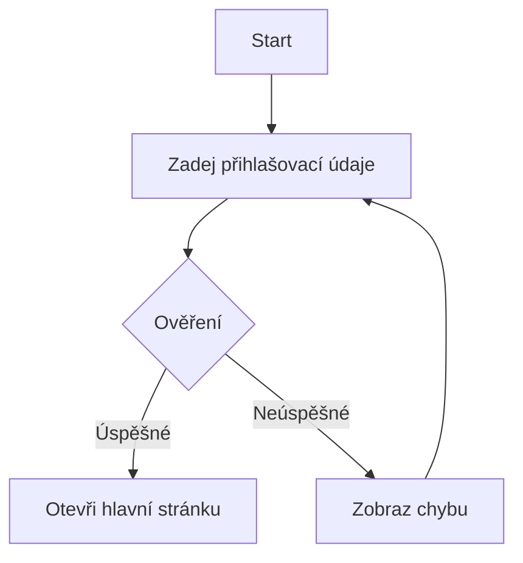
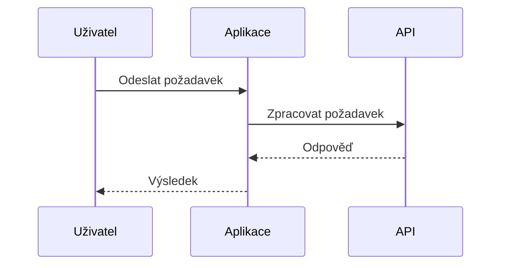
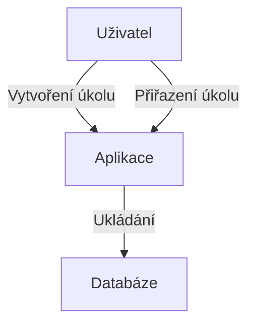

# Dokumentace aplikace: [Název aplikace]

## 1. Úvod

**Účel dokumentace:**  
Stručný popis účelu a rozsahu dokumentace.

**Cílové publikum:**  
Kdo je dokumentace určena.

---

## 2. Popis aplikace

**Obecný popis:**  
Co aplikace dělá, pro koho je určena, hlavní funkcionality.

**Provozní kontext:**  
Jak aplikace zapadá do IT prostředí, vazby na další systémy.

---

## 3. Analytická dokumentace

**Katalog požadavků:**  
- Uživatelské požadavky
- Systémové požadavky

**Funkční specifikace:**  
- Use Case diagram
- Scénáře užití

**Technická specifikace:**  
- Architektura aplikace
- Komponenty, rozhraní, datové modely

**Mermaid – Use Case diagram:**
flowchart TD
Uživatel -->|Přihlášení| Aplikace
Uživatel -->|Správa dat| Aplikace
Aplikace -->|Ukládání| Databáze

text
---

## 4. Řízení služeb

**Definice služby:**  
Za co je služba odpovědná.

**SLA a KPI:**  
Smlouva o úrovni služeb a klíčové ukazatele.

**Kontakty a odpovědnosti:**  
Kdo je za co zodpovědný.

---

## 5. IT bezpečnost a rizika

**Bezpečnostní politika:**  
Jaká pravidla a opatření jsou nastavena.

**Analýza rizik:**  
- Identifikace rizik
- Opatření

**Role a oprávnění:**  
- Uživatelské role
- Oprávnění

---

## 6. Testování a kvalita

**Testovací strategie a plán:**  
- Jak, kdy a co se testuje

**Testovací scénáře:**  
- Příklady testovacích případů

**Záznam výsledků testů:**  
- Evidence chyb a jejich řešení

---

## 7. Provozní a administrátorská dokumentace

**Instalační příručka:**  
- Jak aplikaci nainstalovat

**Uživatelská dokumentace:**  
- Manuál pro uživatele

**Administrátorská příručka:**  
- Postupy pro správu a údržbu

---

## 8. Audit a kontrola

**Auditní plán:**  
- Co a kdy bude auditováno

**Výsledky auditu:**  
- Zjištění, doporučení

**Evidence změn:**  
- Jak jsou změny sledovány

---

## 9. Přílohy

- **Technické specifikace**
- **Seznam dokumentů**
- **Kontakty**

---

# Mermaid diagramy – příklady
## 1. Flowchart – workflow přihlášení

## 2. Sequence diagram – komunikace s API

# Naplněná šablona – příklad

## 1. Úvod

**Účel dokumentace:**  
Dokumentace slouží k popisu funkčnosti, správy a bezpečnosti aplikace pro správu úkolů.

**Cílové publikum:**  
Vývojáři, administrátoři, uživatelé.
## 2. Popis aplikace

**Obecný popis:**  
Aplikace umožňuje uživatelům vytvářet, spravovat a sledovat úkoly v týmu.

**Provozní kontext:**  
Aplikace běží na vlastním serveru, komunikuje s interním uživatelským systémem.
## 3. Analytická dokumentace

**Katalog požadavků:**  
- Uživatel může vytvořit úkol
- Uživatel může přiřadit úkol kolegovi

**Funkční specifikace:**  
- Use Case: Přidání úkolu, přiřazení úkolu

**Technická specifikace:**  
- Architektura: Frontend (React), Backend (Node.js), Databáze (PostgreSQL)

**Mermaid – Use Case diagram:**

## 4. Řízení služeb

**Definice služby:**  
Služba poskytuje správu úkolů pro tým.

**SLA a KPI:**  
- Dostupnost 99,9 %
- Průměrná odezva < 2 s

**Kontakty a odpovědnosti:**  
- Service Owner: Jan Novák
- Kontakt: jan.novak@firma.cz

## 5. IT bezpečnost a rizika

**Bezpečnostní politika:**  
Pouze ověření uživatelé mají přístup.

**Analýza rizik:**  
- Riziko neoprávněného přístupu – řešeno autentizací

**Role a oprávnění:**  
- Uživatel: vytváření úkolů
- Admin: správa uživatelů

---

## 6. Testování a kvalita

**Testovací strategie a plán:**  
- Unit testy, integrační testy

**Testovací scénáře:**  
- Test přidání úkolu
- Test přiřazení úkolu

**Záznam výsledků testů:**  
- Všechny testy prošly

---

## 7. Provozní a administrátorská dokumentace

**Instalační příručka:**  
- Instalace pomocí Docker Compose

**Uživatelská dokumentace:**  
- Návod na vytvoření úkolu

**Administrátorská příručka:**  
- Správa uživatelů, zálohování databáze

---

## 8. Audit a kontrola

**Auditní plán:**  
- Každý měsíc kontrola bezpečnosti

**Výsledky auditu:**  
- Žádné zásadní nedostatky

**Evidence změn:**  
- Sledování změn v Git

---

## 9. Přílohy

- **Technické specifikace:** PostgreSQL 14, Node.js 18
- **Seznam dokumentů:** instalační příručka, uživatelský manuál
- **Kontakty:** jan.novak@firma.cz

---
